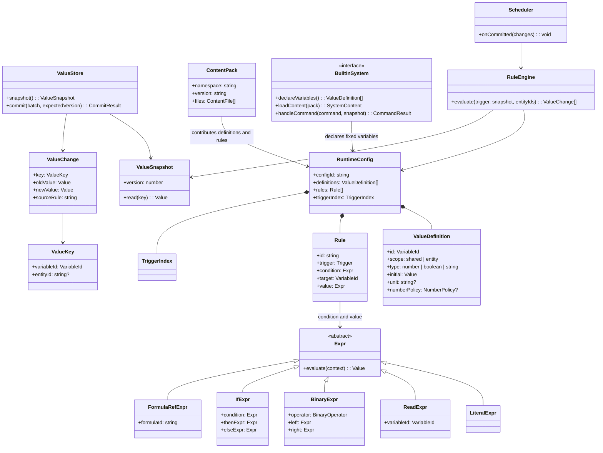

# Core 值与规则运行时改进方案（独立设计草案）

> 状态：设计草案。本文描述拟采用的结构，不代表当前实现，也不要求现有文档立即与之保持一致。本轮只形成文档，不修改代码、内容包或其他文档。

## 1. 设计目标

让一个内容作者能直接回答四个问题：变量定义在哪里、当前值存在哪里、规则怎样算出新值、这个变化怎样触发下一条规则。

拟采用的边界如下：

- **Core** 统一管理规则可读写的变量定义、当前值、快照、表达式计算、规则执行、原子提交、变化传播和存档。
- **Content Pack** 可以声明自己命名空间下的变量、初始值、公式和规则；它声明的变量不必归属 World、Body 等内置系统。
- **World、Body 等内置系统**也向同一个 Core 值机制声明固定的变量，并提供移动、行动等具体功能。它们不另建一套普通变量容器。
- **Content Pack 文件是定义**，运行中的变量当前值属于某条模拟时间线的 `ValueStore`。同一个包可供不同时间线使用，而每条时间线有自己的值。

Core 值机制只覆盖需要被规则读写、追踪、传播和保存的值。行动实例、事件记录、行为树等结构是否也改用该容器，应根据具体操作决定；本方案不要求将所有运行对象压成键值。

## 2. 主要类型

下图是目标设计，不是现有类名或代码接口。图中的 `Value` 初期限定为有限数值、布尔值和字符串；缺失不是第四种值。



`BuiltinSystem` 只表示内置系统向运行时提供功能的窄接口，不是描述整个系统能力的通用 `SystemSpec`。内置系统的固定配置结构和程序接口仍由 TypeScript 类型与该系统自己的加载代码定义。

## 3. 变量声明、身份与寻址

### 3.1 声明来源相同，存储路径相同

内置系统和 Content Pack 都产出 `ValueDefinition`。例如：

```text
body/energy                 // Body 提供的固定变量
demo.story/door-unlocked    // Content Pack 自己定义的变量
demo.weather/fog            // 另一内容命名空间定义的变量
```

这些前缀用于身份和避免重名，不选择不同的求值器或存储器。配置发布时，将所有声明汇总成一个只读定义表，检查重复身份、类型、作用域、单位和初始值。`configId` 标识参与运行的包及固定系统代码语义；新版本不会在已有求值过程中替换旧版本。

Content Pack 可以自行组织地点、人物、文本等内容。只有希望进入通用值机制的变量，需要提供 Core 能读取的变量声明；其他内容由使用它的内置系统解析。`ContentPack` 本身不持有运行中的当前值。

### 3.2 运行时键只有两种形态

```ts
type ValueKey =
  | { variableId: string; scope: "shared" }
  | { variableId: string; scope: "entity"; entityId: string };
```

`variableId` 是编译后确认存在的限定名。`scope` 必须与定义一致。共享值只有一个值槽；实体值按 `entityId` 各有一个值槽。规则中可写 `current` 表示本次求值的实体，编译后保留这种绑定关系，运行时由求值上下文填入实际 `entityId`。规则不能凭任意字符串读取未声明的值。

`ReadExpr` 是对变量的引用，不是值容器，也不是对某个系统对象的访问。它在配置编译时解析变量身份、类型和单位，在规则执行时从本次 `ValueSnapshot` 按 `ValueKey` 读取当前值。内容定义中的固定常量可编译为字面量；可变化的 Content Pack 变量与内置系统变量都走 `ReadExpr`。

新增实体时，Core 按所有适用于该实体的变量定义建立初始值槽；具体哪些变量适用于它，由内容中的实体声明及内置系统的固定规则决定。载入存档时恢复已保存的值，不再重复套用初始值。

## 4. 表达式与规则

Core 使用一套受限 AST。基本节点为字面量、读取、具名公式引用、二元运算和条件选择。二元运算统一覆盖加、减、乘、除、最小值、最大值和比较；比较返回布尔值，`IfExpr` 根据布尔条件选一个分支。具名 `Formula` 只是可复用的表达式定义，并不引入第二套执行语义。

原有阈值与分段 mapping 应先表达为比较、`IfExpr` 和算术运算；只有真实内容证明这种写法明显不便时，才考虑增加能展开成同一 AST 的简写语法。规则内部计算和多规则输出不再各有一套 `combine`。一个目标变量由一条规则负责计算最终值；多个因素应在该规则的表达式中明确组合。配置编译时检查同一目标的重复写方及公式引用环。

编译时检查引用、值类型、单位、作用域和运算是否合法。数值可带单位元数据：同类单位可加减、比较；有单位值乘除无单位数仍保留该单位。无单位数不依赖特殊字符串 `ratio` 才能参与乘法。具体的舍入和范围策略属于目标变量声明，由提交时统一应用一次。

规则只根据传入的配置版本、状态快照、实体集合及显式模拟时间求值。不得在表达式中读取系统时钟、文件、网络或可变的系统对象。相同输入必须得到相同候选变化和稳定顺序。

## 5. 从一个值到下一条规则

下例为目标语法的示意，不是当前内容包格式：

```yaml
variables:
  - id: demo.story/door-unlocked
    scope: shared
    type: boolean
    initial: false
  - id: demo.story/hall-accessible
    scope: shared
    type: boolean
    initial: false

rules:
  - id: unlock-door
    on: demo.story/key-used
    set: demo.story/door-unlocked
    value: { literal: true }
  - id: update-hall-access
    onChange: demo.story/door-unlocked
    set: demo.story/hall-accessible
    value: { read: demo.story/door-unlocked }
```

执行顺序是：

1. 调度器收到明确的 `key-used` 触发器，在同一 `ValueSnapshot` 上选择 `unlock-door`。
2. Core 计算出候选值 `true`。候选值本身不修改状态。
3. Core 对照目标定义检查类型，并检查候选基于的快照版本；批量提交成功后，`door-unlocked` 从 `false` 变为 `true`。若值未改变，不产生变化事件。
4. Core 根据已提交的 `ValueChange` 找到 `onChange: door-unlocked`，选择 `update-hall-access`；后者从新快照读取 `true`，计算并提交 `hall-accessible = true`。
5. 新变化可以继续传播，但每一轮只根据**实际已提交的变化**选择后续规则；按稳定顺序执行，并有明确的轮数上限。超过上限报告错误，不暗中迭代到收敛。

条件为假、输入缺失、表达式失败、类型不符或版本过期时，相关候选不得提交；追踪应说明规则、读取的值、失败原因以及提交结果。

编译器为每条规则提取输入依赖，包括被引用公式的传递依赖。变化索引据此选择规则，而不扫描全部规则；显式事件与 Tick 也可作为触发源，但必须在规则中明示。

## 6. 提交、内置系统与其他运行对象

Core 的 `ValueStore` 是规则值的唯一权威来源。内置系统需要普通变量时，也从快照读取并向 Core 提交变化，不复制一份长期有效的当前值。它们可以提供便利的 TypeScript 包装，让固定变量在程序中保有静态类型。

内置系统仍可处理移动、行动、实体关系等具体操作。这样的操作可能读取多个变量、修改多个变量或修改非标量结构；它应先计算一份完整的候选结果，再在对应的 Tick 阶段提交。若一次操作同时修改 Core 值和其他运行结构，必须采用同一个发布边界，不能让规则看到只提交了一半的状态。这一边界要在迁移实施前以具体的移动和行动场景确定，不能靠分别调用两个 `commit()` 假装原子性。

过程是带身份、参数和推进时机的运行记录。建立、推进和结束由明确命令与调度器处理；过程中的某个字段若需要由规则直接读写，可声明为 Core 变量。无需为了普通变量定义类似 `MonoBehaviour` 的生命周期对象。

本设计不把模型生成文本、记忆内容或其他非确定性结果直接写进表达式。模型结果先成为显式输入，在既定 Tick 边界被接受后，相关变量变化再进入统一传播路径。

## 7. 配置、保存与恢复

- 解析配置时验证外部文件的结构；编译规则时验证引用、类型、单位、写方和依赖；运行时提交只做版本与目标值约束检查。不要为同一事实设置重复的验证层。
- `RuntimeConfig` 不可变并有 `configId`。`ValueSnapshot` 包含值表版本。一次规则求值始终使用同一配置及同一快照。
- 每条模拟时间线的存档同时保存 `configId`、Tick、ValueStore 当前值及仍需保存的其他运行对象。恢复时先确认配置版本可用，再恢复完整快照；不能由新内容包的初始值补写旧存档缺失字段。
- Core 仅向调度器发布成功提交且实际变化的值。追踪记录变量身份、实体、旧值、新值、来源规则、配置与状态版本，便于解释传播链。

## 8. 与当前实现的关系及实施顺序

当前实现已经有受限 `ValueExpr`，但还存在独立 mapping、规则输出组合、`SystemSpec` 值展开和 World/Body 持有权威值。规则执行前，运行状态还要投影为 `shared/entities` 输入。本文拟收敛这些重叠路径，不主张为了换名称而重复实现同样的抽象。

实施时应按以下顺序推进，避免同时改变存储、语法和业务结果而无法定位偏差：

1. 固定现有演示内容在同一配置、快照和 Tick 下的结果与传播顺序，列出每个规则值的来源、目标和写方。
2. 实现 Core 变量定义表、`ValueKey`、快照及批量提交接口，先迁移一个 Content Pack 自有变量，贯通初始化、规则、传播和存档。
3. 将 World/Body 已暴露给规则的普通值迁入同一 Store，消除重复持有和求值投影；逐项处理涉及实体关系、行动的提交边界。
4. 将现有表达式、mapping 和两层 combine 改写为统一 AST 与单目标写方；迁移演示规则，保留结果一致性的对照记录。
5. 由内置系统自己的类型和加载代码取代多余的通用 `SystemSpec` 描述，最后移除失去用途的校验与索引代码。
6. 更新正式设计与用户文档，并为新存档格式作版本区分。旧存档是否迁移，是实施前需明确的兼容性决定。

验收的核心场景是：Content Pack 独立变量和内置系统变量经同一 Store 读写；变量变化能按索引触发另一条规则；同输入同结果；一个操作不会发布半套状态；保存和恢复后继续运行得到相同结果。测试聚焦这些主路径。

## 9. 尚待具体决策

以下问题不靠额外通用框架预先解决，应在迁移对应场景前确定：

1. **结构化状态边界**：哪些现有 World/Body 字段是规则值，哪些是需要专门结构和操作的记录。
2. **跨结构提交**：移动和行动同时改变值与实体关系时，如何在一个 Tick 发布边界保证一致。
3. **多写方内容迁移**：现有 `min/add/multiply/priority` 的多规则目标，分别由哪条最终规则负责，公式如何复用。
4. **旧存档兼容**：提供迁移工具，还是明确拒绝旧格式。两者都不能静默改变恢复结果。

这四项会影响实施范围，但不改变本文已确定的核心结论：**规则值由 Core 统一持有、计算和传播；Content Pack 与内置系统以相同机制声明变量。**
